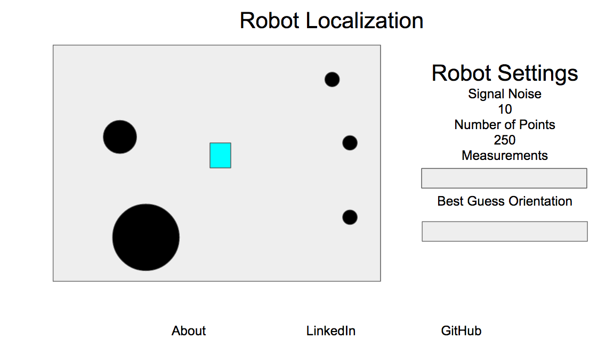

# Robotic Localization

## Background
In robotics, localization refers to the method which answers the following question: where am I now? A particle filter represents one method to answering this question in a 2D space. At a high level, a particle filter assumes a robot is equally likely to be at any location in the world. It is able to narrow down it's belief based on measurements taken compared against the known map. This project is am implementation of such a method. Using only a range finder (with simulated noise), a virtual robot is able to determine it's location in a pre-mapped enviroment.

## Functionality
Robotic Localization will have the ability to

1. Control a virtual robot with WASD arrow keys
1. Collision detection
1. Vector math to calculate position
1. An option to increase the noise due to sensor measurements

## Wireframes
This app will consist of a single screen which contains a title, a HTML canvas element, and links to an about modal, my linkedin profile, and my github account.

## Architecture
This app will be implemented using the following libraries:

1. Vanilla javascript and jquery for DOM management
1. Vanilla javascript to implement particle filter algorithm.
1. Webpack to bundle files
1. EaselJS to render HTML 5 elements

## Implementation Timeline
Day 1:  
Complete definition of robot, static object, and simulation container classes
* Define a robot object class which is an extension of the EaselJS Shape class
* Define a method to move the robot
* Define an update state method to move the robot
* Bind event handlers to move the robot
* Define a static object class which is an extension of the EaselJS Shape class
* Define four walls and three random land marks around the canvas element
* Define a utility to find the distance from the robot to any object

Day 2:  
Definition of specific robot methods and implementation
* Define a method for the robot to map distances to objects over a 360 degree sweep
* Define a method for scoring similarity between the arrays
* Define a simulation container class which keeps track of active robot, possible points, and static objects
* Define a method to repopulate point information
* Combine all methods together, debug as needed, ensure implementation works as intended.
* Create HTML elements to allow varying of signal noise
* Create HTML element to allow varying the number of particles
* Additional debug as needed

Day 3:
Increase user-friendliness
* Initiate on document load
* Provide instructions to the user
* Add button to reset the robot's knowledge of it's location
* Display a side by side comparison of the measurement array with the knowledge array in real time
* Add legend and description as needed.

Day 4:
* Work on production readme
* Figure out how to host it.

## Bonus Features
Time permitting, there are several options I would like to implement:
* A "kick the robot" function to relocate it to a random point and visualize how it relocalizes itself
* A method to add new obstacles which were not included in the initial map.
* Add a pathing feature where a robot determines the best route to get to another point and plots a line indicating it's intended path
