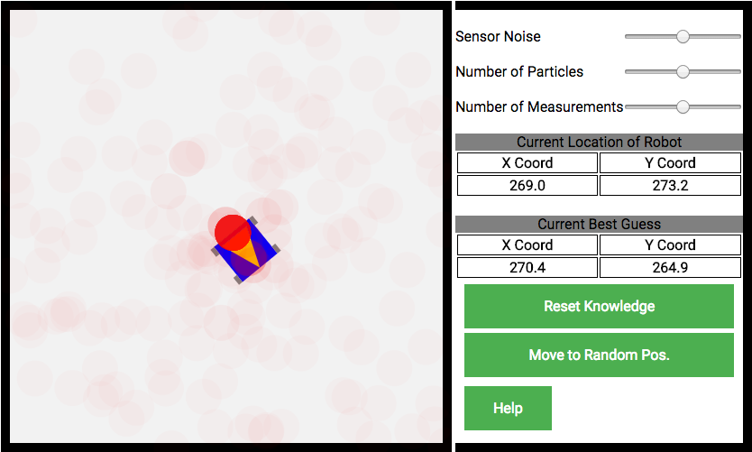

# Robotic Localization

## Background
In robotics, localization refers to the method used to answer the following question: where am I now? This question becomes increasingly complex when real-life issues are included in the model. Small sensor or locomotion variances can result in errors over time. A particle filter is one method which addresses these issues. At a high level, a particle filter assumes a robot is equally likely to be at any location in the world. It is able to narrow down it's belief based on measurements compared with expected measurements of the known map and estimate it's position on what is most likely. This project is a visualization of such a method. Using only a range finder (with simulated noise), a virtual robot is able to determine it's location in a pre-mapped environment.

The work here is based on methods learned from the Artifical Intelligence for Robotics course on Udacity.

## Instructions
  
At the start of the simulation, the robot is placed in the center environment and it has no information about it's current location. This is indicated by the even distribution of red dots which represent possible locations of the robot. Using the WASD keys, the user is able to move the robot.

  

After a few movements, darker and clearer red dots begin to appear around the location of the robot. These represent locations the robot is confident it is. A comparison of the actual location and the best guess is shown on the right.

## Features

[Video 1](https://www.youtube.com/embed/lvX3sAuEW2M)

The preceding video demonstrates one of the features of the particle filter. The robot is able to localize itself after it has been moved to a random location.

[Video 2](https://www.youtube.com/embed/XmqkNExMm1A)

This video demonstrates how sensor noise affects the robot's confidence in it's location. Noise is initially increased, which results in a larger distribution of red dots. Once it is removed, the confidence increases and the number of distribution of red dots localizes around the robot.

## Architecture
This app is implemented using the following libraries:

1. Vanilla javascript and jquery for DOM management
1. Vanilla javascript to implement particle filter algorithm.
1. Webpack to bundle files
1. EaselJS to render HTML 5 elements

## Additional Features
The method used to rank the relevance of existing particles currently uses a percentage difference from measured results as it's input. I would like to implement a new scoring system based on the squared difference rather than percent difference.

Current method of determining location takes distance measurements from the wall. I would like to develop functionality of the robot to sense it's immediate surroundings so that it can determine it's location based on additional obstacles.
